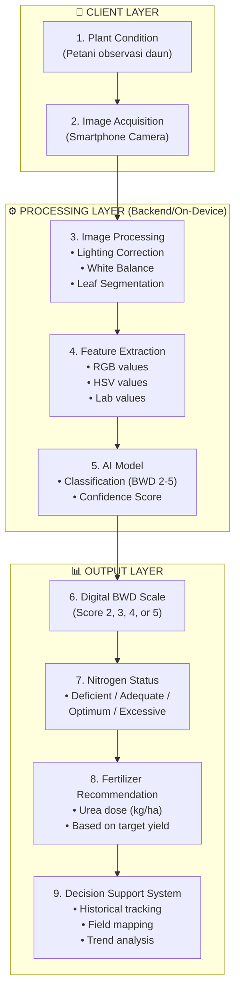
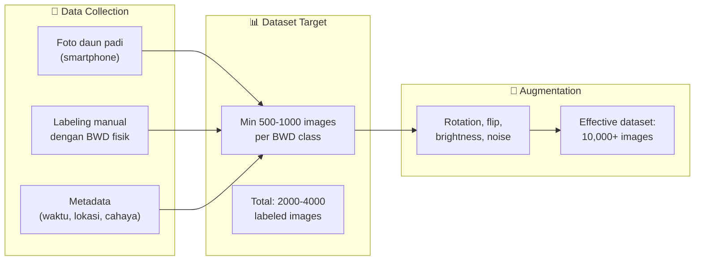
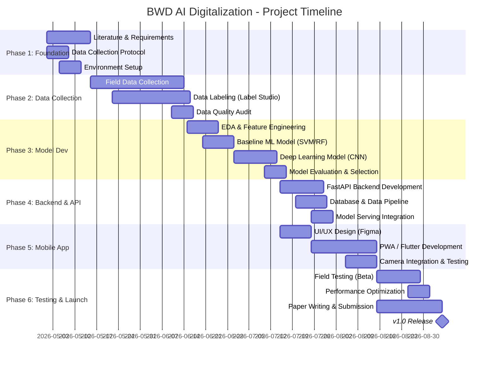

# 🌾 BWD AI Digitalization System — Implementation Plan

> **Project**: Pengembangan Sistem Digitalisasi Bagan Warna Daun (BWD) Berbasis AI
> **Team**: Teguh Iman Santoso (Om Iman), Fakhri Musyafa Budiman, Restu
> **Date**: 28 April 2026

---

## 1. Project Assessment — Apakah Sudah Oke?

### ✅ Yang Sudah Sangat Kuat

| Aspek | Status | Catatan |
|-------|--------|---------|
| Artikel Draft | 🟢 Solid | Literature review kuat, research gap jelas, novelty terumuskan |
| Problem Statement | 🟢 Clear | BWD manual = subjektif, perlu digitalisasi |
| Flow Diagram | 🟢 Excellent | 9-step pipeline sudah end-to-end (dari citra → rekomendasi pupuk) |
| Reference Standard | 🟢 Available | IRRI BWD scale (2-5) sudah jadi ground truth |
| Dosage Table | 🟢 Defined | Mapping BWD → Urea (kg/ha) berdasarkan target yield sudah ada |
| Market Impact | 🟢 High | Petani kecil = target user, problem nyata di lapangan |

### ⚠️ Yang Perlu Dimatangkan Sebelum Build

| Aspek | Status | Action Needed |
|-------|--------|---------------|
| Dataset | 🟡 Belum ada | Butuh kumpulan foto daun padi + label BWD (ground truth) |
| Model Validation | 🟡 Belum ada | Butuh baseline accuracy target |
| User Research | 🟡 Minimal | Perlu validasi apakah petani bisa pakai smartphone app |
| Deployment Strategy | 🟡 Belum defined | Mobile app? Web app? Offline capable? |
| Ethical/Regulatory | 🟡 Perlu dicek | Apakah perlu izin BPTP atau Dinas Pertanian? |

> [!IMPORTANT]
> **Verdict**: Fondasi konseptual & akademik sudah **sangat mature**. Yang kurang adalah **eksekusi teknis** — yaitu dataset, model training, dan deployment. Plan di bawah ini akan menutup gap tersebut.

---

## 2. System Architecture — Matching Om Iman's Flow

Berikut arsitektur teknis yang di-mapping ke 9-step flow Om Iman:



### 📍 Protokol Sampling Lapangan (Multi-Leaf Batching)

Poin sangat penting: **Petani tidak memupuk berdasarkan 1 daun saja**. Sawah itu luas (berpetak-petak), jadi aplikasinya harus mengakomodasi metode sampling yang benar secara agrikultur (seperti standar IRRI):

1. **Metode Sampling**: Petani diminta mengambil **10 sampel daun** secara acak (diagonal atau zigzag) dari satu petak sawah.
2. **Batch Processing di Aplikasi**: 
   - UX aplikasi bukan sekadar "Scan 1 Foto → Keluar Hasil".
   - Melainkan: "Sesi Scan Petak A (Sampel 1/10, 2/10... 10/10)".
3. **Agregasi AI**: AI akan menghitung BWD dari ke-10 foto tersebut, lalu mengambil **Rata-rata (Average/Majority Vote)**.
4. **Distribusi Merata**: Dari rata-rata tersebut, aplikasi mengeluarkan dosis Urea per Hektar (atau Are), dan memberi panduan kepada petani untuk **menyebarkan pupuk secara merata (broadcasting)** di seluruh petak sawah tersebut, bukan cuma di area daun yang difoto.

*Catatan: Konsep "Batch Scan 10 Daun" ini akan diimplementasikan sebagai fitur utama di Mobile App Native (Fase 5).*

### Technical Mapping per Step

| Step | Component | Technology | Detail |
|------|-----------|-----------|--------|
| 1-2 | Image Capture | Smartphone Camera API | Guided capture with overlay frame |
| 3 | Pre-processing | OpenCV, Pillow | Auto white-balance, histogram equalization, GrabCut/U-Net segmentation |
| 4 | Feature Extraction | OpenCV, scikit-image | Extract mean/std/histogram dari RGB, HSV, Lab per leaf ROI |
| 5 | AI Classification | PyTorch / TensorFlow | CNN (EfficientNet/MobileNet) atau ML klasik (SVM/Random Forest) |
| 6 | BWD Mapping | Rule engine + model output | Map predicted class → BWD scale 2-5 |
| 7 | N-Status Logic | Lookup table | BWD score → Nitrogen status category |
| 8 | Fertilizer Calc | Lookup table + target yield input | IRRI dosage table: BWD × Target Yield → Urea kg/ha |
| 9 | DSS Dashboard | Web dashboard + DB | Historical records, field tracking, analytics |

---

## 3. Technology Stack — Complete Recommendation

### Core AI/ML (Python Ecosystem)

| Tool | Purpose | Why |
|------|---------|-----|
| **Python 3.11+** | Primary language | Ecosystem terlengkap untuk CV & ML |
| **OpenCV** | Image processing (step 3-4) | Standard industri, well-documented |
| **scikit-image** | Advanced image analysis | Segmentasi & feature extraction |
| **PyTorch** | Deep learning model (step 5) | Flexible, research-friendly, community besar |
| **scikit-learn** | Classical ML baseline | SVM, Random Forest sebagai baseline comparison |
| **NumPy / Pandas** | Data manipulation | Foundation untuk semua processing |
| **Albumentations** | Data augmentation | Augmentasi citra untuk training robust |
| **Matplotlib / Seaborn** | Visualization | EDA, training curves, confusion matrix |
| **ONNX Runtime** | Model export for mobile | Convert PyTorch → ONNX untuk deployment ringan |

### Backend API

| Tool | Purpose | Why |
|------|---------|-----|
| **FastAPI** | REST API server | Cepat, async, auto-documentation (Swagger) |
| **PostgreSQL** | Database utama | Relational, robust, free |
| **SQLAlchemy** | ORM | Type-safe database access |
| **Redis** | Caching | Cache model predictions, rate limiting |
| **Docker** | Containerization | Reproducible deployment |
| **Nginx** | Reverse proxy | Production-grade serving |

### Mobile App (untuk Petani)

| Option | Pros | Cons | Recommendation |
|--------|------|------|----------------|
| **Flutter** | Cross-platform, single codebase, native performance | Learning curve Dart | ⭐ **Recommended** |
| **React Native** | JavaScript-based, large community | Performance slightly lower | Good alternative |
| **PWA (Web App)** | No app store, instant access | Limited camera control | MVP option |

> [!TIP]
> **Recommended Path**: Mulai dengan **PWA (Progressive Web App)** untuk MVP/proof-of-concept, lalu migrasi ke **Flutter** untuk production app. PWA bisa dibangun cepat dan langsung testable tanpa install.

### 📱 Calendar & Notification Strategy (UX)

Agar aplikasi tidak sekadar menjadi scanner pasif, sistem Kalender dan Notifikasi diintegrasikan secara proaktif:

1. **Onboarding Tanam**: Petani mendaftarkan tanggal tanam padi (HST 0) di aplikasi.
2. **Local Logic (MVP - Saat Ini)**: Aplikasi menghitung timeline kritis (misal: 25 HST, 35 HST). Indikator visual (red dot 🔴) dan notifikasi lokal (in-app) diaktifkan saat mendekati tanggal tersebut.
3. **Push Notifications (Fase 5 - Native)**: Saat bermigrasi ke Android Native (Flutter), sistem akan menggunakan OS-level push notifications sehingga alarm pengingat muncul di layar HP meski aplikasi ditutup.
4. **WhatsApp Integration (Fase 6 - Advance)**: Backend mengirimkan pengingat jadwal pupuk via WhatsApp Bot (karena WA adalah media komunikasi yang paling sering dibuka oleh petani).

### 📊 Dashboard & Calendar Integration (Actionable Metrics)

Sistem Dashboard telah berevolusi dari *Vanity Metrics* (sekadar menghitung angka saran dari kamera) menjadi **Actionable Metrics**:
- **Actual Dose Tracking**: Petani mencatat jumlah pupuk aktual yang ditebar ke dalam *log* Kalender.
- **Real-world Savings**: Penghematan uang dihitung murni dari pengeluaran pupuk aktual vs praktik tradisional, memberikan petani visualisasi *Return on Investment* (ROI) yang akurat dan berbasis data riil.

### Beyond Python — Tools yang Juga Dibutuhkan

| Category | Tools |
|----------|-------|
| **Version Control** | Git + GitHub |
| **Cloud/Hosting** | Google Cloud Platform (GCP) atau AWS — ada free tier |
| **Model Serving** | TensorFlow Serving / TorchServe / ONNX Runtime Server |
| **Labeling Tool** | Label Studio (open-source) untuk annotasi dataset |
| **Experiment Tracking** | MLflow atau Weights & Biases (W&B) |
| **CI/CD** | GitHub Actions |
| **Documentation** | MkDocs atau Notion |
| **Design** | Figma (untuk UI/UX mockup) |

---

## 4. Data Strategy — The Most Critical Part

> [!CAUTION]
> **Dataset adalah bottleneck #1**. Tanpa data berlabel yang cukup, model AI tidak bisa dibangun. Ini harus jadi prioritas tertinggi.

### Data Collection Plan



### Data Collection Protocol

| Parameter | Specification |
|-----------|--------------|
| **Device** | Smartphone (berbagai merk untuk variabilitas) |
| **Lighting** | Outdoor natural light (pagi, siang, sore — 3 kondisi) |
| **Angle** | Top-down, ~20cm dari daun |
| **Background** | Kontras (misal: kertas putih di belakang daun) |
| **Labeling** | 2 observer independen cocokkan dengan BWD fisik, resolusi label = {2, 2.5, 3, 3.5, 4, 4.5, 5} |
| **Metadata** | Timestamp, GPS, cuaca, varietas padi, umur tanam (HST) |
| **Target per class** | Min 500 foto per BWD level |
| **Total minimum** | ~2,000-4,000 raw images |

### Data Sources

1. **Field Collection** (primary) — kerjasama dengan petani lokal/BPTP
2. **Existing Datasets** — cek PlantVillage, Kaggle rice datasets
3. **Synthetic Augmentation** — augment dengan variasi lighting, angle, noise
4. **BWD Reference Photos** — foto BWD chart sendiri sebagai color calibration reference

---

## 5. ML Model Development Strategy

### Phase 1: Baseline (Classical ML)

```
Input: Leaf image → Preprocessing → Extract RGB/HSV/Lab stats → SVM/Random Forest → BWD class
```

- **Why start here**: Cepat, interpretable, butuh data lebih sedikit
- **Expected accuracy**: ~70-80% (good enough untuk validasi konsep)
- **Timeline**: 1-2 minggu setelah dataset ready

### Phase 2: Deep Learning

```
Input: Leaf image → Preprocessing → CNN (MobileNetV3/EfficientNet-B0) → BWD class + confidence
```

- **Why upgrade**: Accuracy lebih tinggi, bisa handle variasi lighting better
- **Architecture choices**:

| Model | Size | Speed | Accuracy | Mobile-friendly |
|-------|------|-------|----------|-----------------|
| **MobileNetV3-Small** | 2.5 MB | ⚡⚡⚡ | Good | ✅ Best |
| **EfficientNet-B0** | 20 MB | ⚡⚡ | Better | ✅ Good |
| **ResNet-18** | 45 MB | ⚡ | Good | ⚠️ OK |
| **Custom lightweight CNN** | <5 MB | ⚡⚡⚡ | Variable | ✅ Best |

> [!TIP]
> **Recommended**: Start dengan **MobileNetV3-Small** — kecil, cepat, bisa jalan di smartphone langsung (on-device inference). Transfer learning dari ImageNet.

### Phase 3: Refinement

- Color calibration reference card system
- Multi-crop support (beyond rice)
- Continuous learning from user feedback

---

## 6. Detailed Timeline — 6 Phases



### Phase Breakdown

| Phase | Duration | Key Deliverables | Who |
|-------|----------|-----------------|-----|
| **1. Foundation** | 2 weeks | Requirements doc, dev environment, data collection SOP | All |
| **2. Data Collection** | 4-5 weeks | 2,000+ labeled leaf images, quality audit report | Om Iman + Restu (field), Fakhri (labeling tool) |
| **3. Model Development** | 4 weeks | Trained model with >85% accuracy, evaluation report | Fakhri (lead), Om Iman (validation) |
| **4. Backend & API** | 3 weeks | Working API endpoint, database, model serving | Fakhri |
| **5. Mobile App** | 3-4 weeks | Working app with camera capture + prediction | Fakhri + Restu |
| **6. Testing & Launch** | 3 weeks | Beta test results, optimized model, paper draft | All |
| **Total** | **~4-5 months** | Production-ready v1.0 + research paper | |

---

## 7. Resource & Cost Breakdown

### Compute Resources

| Resource | Option | Cost | Notes |
|----------|--------|------|-------|
| **Development Machine** | Local PC with GPU | Already owned (assumed) | NVIDIA GPU recommended for training |
| **Cloud Training** | Google Colab Pro | $12/month | Good enough for model training |
| **Cloud Training (Alt)** | AWS/GCP spot instances | ~$0.30-1.00/hr | For larger experiments |
| **Hosting (API)** | Railway / Render / GCP Cloud Run | $0-25/month | Start free tier |
| **Database** | Supabase (PostgreSQL) | Free tier | 500 MB free |
| **Domain** | Custom domain | ~$12/year | e.g., bwd-ai.id |

### Human Resources

| Role | Person | Time Commitment |
|------|--------|----------------|
| **ML Engineer / Dev Lead** | Fakhri | 15-20 hrs/week |
| **Domain Expert / Advisor** | Om Iman | 5-10 hrs/week (guidance, validation, field access) |
| **Data Collection / Testing** | Restu | 10-15 hrs/week (especially Phase 2 & 6) |

### Estimated Total Cost (MVP)

| Item | Cost |
|------|------|
| Google Colab Pro (4 months) | ~$48 |
| Hosting (4 months free tier) | $0 |
| Domain | ~$12 |
| BWD physical chart | Already owned |
| Smartphone for capture | Already owned |
| Label Studio | Free (open-source) |
| **Total MVP Cost** | **~$60 (under Rp 1 juta)** |

> [!NOTE]
> Ini sangat terjangkau. Mayoritas tools yang dibutuhkan itu **free/open-source**. Cost utama adalah **waktu dan effort**.

---

## 8. Apakah Antigravity Bisa Sustain Proyek Ini?

### ✅ Apa yang Bisa Antigravity Bantu

| Capability | How It Helps |
|-----------|--------------|
| **Code Writing** | Menulis seluruh pipeline: preprocessing, feature extraction, model training, API, frontend |
| **Architecture Design** | Merancang system design, database schema, API contracts |
| **Debugging** | Debug model performance, data pipeline issues |
| **Research** | Cari paper terbaru, benchmark model, best practices |
| **Documentation** | Generate README, API docs, paper sections |
| **Web App / Dashboard** | Build DSS dashboard (step 9) langsung |
| **Data Analysis** | EDA, visualisasi distribusi warna, model evaluation |
| **Code Review** | Review kode untuk best practices & optimization |

### ⚠️ Apa yang Antigravity TIDAK Bisa Bantu

| Limitation | Why | Solution |
|-----------|-----|----------|
| **Foto di sawah** | Butuh ke lapangan fisik | Tim harus ke sawah sendiri |
| **Labeling manual** | Perlu cocokkan daun dengan BWD fisik | Pakai Label Studio, tim label sendiri |
| **Model training GPU** | Training butuh GPU compute | Pakai Google Colab atau local GPU |
| **Mobile app testing** | Butuh device fisik | Test di HP sendiri |
| **Field validation** | Validasi akurasi di lapangan nyata | Tim test langsung |
| **Persistent server** | Antigravity bukan hosting service | Deploy ke cloud (Railway/GCP) |

### 💡 Sustainability Verdict

> [!IMPORTANT]
> **Yes, Antigravity bisa jadi "co-developer" utama kalian.** Aku bisa bantu:
> - Menulis **seluruh codebase** (preprocessing, training, API, frontend)
> - Iterasi model dan debug
> - Build dashboard dan web app
> - Maintain documentation
>
> Yang perlu kalian handle sendiri: **data collection di lapangan**, **labeling**, dan **deployment ke cloud**. Tapi untuk coding dan arsitektur, aku bisa sustain sepanjang proyek.

---

## 9. Recommended Immediate Next Steps

### Week 1 Action Items

- [ ] **Finalisasi tim & roles** — Siapa lead apa? (lihat tabel di Section 7)
- [ ] **Setup GitHub repo** — Aku bisa bantu bikinin structure-nya
- [ ] **Setup Python environment** — `requirements.txt` dengan semua dependencies
- [ ] **Buat Data Collection SOP** — Protokol foto yang standar
- [ ] **Identifikasi lokasi sawah** — Kerjasama dengan petani / BPTP lokal
- [ ] **Tentukan target deployment** — PWA dulu atau langsung Flutter?

### Quick Win — Yang Bisa Kita Bangun Sekarang

Bahkan sebelum dataset siap, kita bisa:

1. **Build preprocessing pipeline** — Test dengan foto BWD chart yang sudah ada
2. **Build color extraction module** — Extract RGB/HSV/Lab dari sample images
3. **Build fertilizer recommendation engine** — Lookup table dari IRRI data
4. **Build web app prototype** — UI mockup yang sudah bisa capture foto dan tampilkan dummy result
5. **Build labeling infrastructure** — Setup Label Studio untuk nanti

---

## 10. Open Questions untuk Tim

> [!WARNING]
> Tolong diskusikan pertanyaan-pertanyaan ini sebelum kita mulai build:

1. **Varietas padi** — Apakah fokus ke satu varietas dulu (misal IR64) atau langsung multi-varietas?
2. **Lokasi geografis** — Sawah di daerah mana? Ini pengaruh ke kondisi cahaya dan variasi
3. **Target akurasi** — Berapa minimum accuracy yang acceptable? (saran: ≥85% untuk 4-class)
4. **Offline capability** — Apakah app harus bisa jalan tanpa internet? (penting untuk petani di daerah terpencil)
5. **Collaboration with BPTP** — Apakah sudah ada koneksi ke Balai Pengkajian Teknologi Pertanian?
6. **Paper target** — Jurnal mana yang ditarget? (Q1 international? Nasional terakreditasi SINTA?)
7. **Timeline preference** — Apakah timeline 4-5 bulan realistis dengan waktu yang tersedia?
8. **Budget constraint** — Ada budget khusus atau bootstrapped?
9. **Existing data** — Apakah sudah ada foto daun padi yang bisa dipakai awal?
10. **Patent/IP** — Apakah ada rencana paten untuk sistem ini?

---

## 11. Risk Mitigation

| Risk | Probability | Impact | Mitigation |
|------|------------|--------|------------|
| Dataset terlalu kecil | High | Critical | Aggressive augmentation + synthetic data + transfer learning |
| Akurasi model rendah | Medium | High | Start with classical ML baseline, iterate |
| Variasi smartphone camera | High | Medium | Color calibration card system (foto kartu referensi dulu) |
| Tim busy / timeline slip | High | Medium | Prioritize MVP features, iterative release |
| Lighting inconsistency | High | Medium | Image preprocessing pipeline + augmentasi kondisi cahaya |
| Petani sulit adopsi app | Medium | High | UX ultra-simple, lokal language, minimal steps |

---

## Summary

| Aspect | Assessment |
|--------|-----------|
| **Konsep & Artikel** | ⭐⭐⭐⭐⭐ Sangat solid, research gap jelas |
| **Flow Architecture** | ⭐⭐⭐⭐⭐ End-to-end, well-designed |
| **Feasibility** | ⭐⭐⭐⭐ Sangat feasible, tools mostly free |
| **Estimated Cost** | ⭐⭐⭐⭐⭐ Under Rp 1 juta untuk MVP |
| **Timeline** | ⭐⭐⭐⭐ 4-5 bulan realistis |
| **Antigravity Sustainability** | ⭐⭐⭐⭐ Bisa sustain untuk coding, perlu tim untuk field work |
| **Impact Potential** | ⭐⭐⭐⭐⭐ Sangat berdampak untuk pertanian Indonesia |

**Bottom line**: Proyek ini **sangat layak dieksekusi**. Fondasinya kuat, cost-nya rendah, dan impact-nya tinggi. Yang paling kritis sekarang adalah **mulai kumpulkan dataset** sambil aku bantu build infrastructure-nya.
